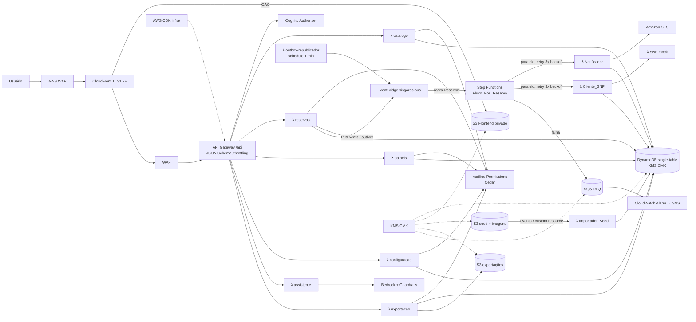

# Design Document — SISGARES Reservas

## Overview

SISGARES: reservas de ambientes, recursos e serviços do MPF, com prevenção de conflitos (RN5/RN6, margem 30 min), controle de recursos limitados (RN8), notificações, SNP simulado e painéis por perfil.

| Decisão | Escolha | Motivo |
|---|---|---|
| Computação | Lambda Java 21 + SnapStart, uma por contexto | Escala sob demanda, cold start reduzido (Req. 2.1) |
| Domínio | Módulo `dominio` Java puro, `Clock` injetável | Testável sem AWS (Req. 1.3, 22.7) |
| Persistência | DynamoDB single-table + GSIs, sem Scan | Latência baixa, padrões de acesso conhecidos (Req. 3) |
| Concorrência | `TransactWriteItems` + versão no Item_Controle | Bloqueio otimista RN7 (Req. 10.6) |
| Assíncrono | EventBridge → Step Functions (ramos paralelos) + outbox | Isola falhas de e-mail/SNP (Req. 2.4–2.8) |
| Autorização | Cognito (autenticação) + Verified Permissions/Cedar | Regras finas por dono/setor/unidade (Req. 5) |
| IA | Bedrock + Guardrails, saída validada por JSON Schema | Somente propostas (Req. 18) |
| IaC | AWS CDK (Java) em `infra/` | Deploy/destroy por comando (Req. 23) |

## Architecture



- Todas as Lambdas: X-Ray, logs JSON (Powertools), role IAM própria, variáveis de ambiente/SSM.
- Modo local: SAM local + DynamoDB Local + mock de Cognito (JWT fictício) + Caixa_Simulada.

## Components and Interfaces

### Monorepo

```
/frontend        Angular (standalone components, Angular Material/CDK a11y)
/backend         Maven multimódulo (pom pai)
  dominio/       Java puro: modelos, Validador_Reserva, calculadoras, LeitorCsv
  comum-aws/     repositórios DynamoDB (SDK v2 enhanced), Autorizador AVP, logs
  catalogo/  reservas/  paineis/  configuracao/
  eventos/       Notificador, Cliente_SNP, SNP mock, outbox
  seed/  assistente/  exportacao/
/infra           CDK (stacks: Rede/Seg, Dados, Api, Eventos, Front), cedar/*.cedar
/data /imagens   CSVs e ícones
/docs            arquitetura, modelo DynamoDB, ER, OpenAPI, LGPD, uso do Kiro
/.kiro           specs, steering, hooks
```

Dependências: contextos → `comum-aws` → `dominio`. `dominio` sem nenhuma dependência AWS (verificado por enforcer).

### Núcleo_Domínio (todos recebem `Clock`)

| Componente | Assinatura | Regras |
|---|---|---|
| Validador_Reserva | `List<Violacao> validar(Reserva r, ContextoValidacao ctx)` | RN1–RN9, RN12; acumula todas as violações |
| DetectorConflito | `boolean conflita(Periodo a, Periodo b)`; `List<Conflito> conflitos(Reserva r, List<PeriodoOcupado> ocupados, ArvoreAmbientes arv)` | `a.ini < b.fim+30m && b.ini < a.fim+30m`; RN5 mesmo ambiente, RN6 relacionado; ignora Local_Proprio e própria reserva |
| CalculadoraDisponibilidade | `int disponivel(Recurso r, Periodo p, List<SolicitacaoOcupada> outras)` | Pico de uso em intervalos que se cruzam (sem margem) |
| CalculadoraStatus | `Status status(Reserva r)` | cancelada > prevista > transcorrida > em andamento (RN13) |
| CalculadoraGrade | `Grade calcular(ParametrosGrade p, List<PeriodoOcupado> ocupados, Configuracao cfg)` | Estados: LIVRE, OCUPADO, MARGEM, ULTRAPASSADO, SEM_ANTECEDENCIA; reutiliza DetectorConflito |
| ComparadorVersoes | `List<Diferenca> comparar(VersaoReserva ant, VersaoReserva nova)` | Campo, valor antigo, valor novo |
| ResolvedorIcone | `ResultadoIcone resolver(String refCsv, Categoria cat, Set<String> arquivos)` | 1 match → nome; 0 → `ICONE_NAO_ENCONTRADO`; >1 → `ICONE_AMBIGUO` (padrão `indefinido_*`) |
| LeitorCsv | `<T> ResultadoLeitura<T> ler(Reader in, MapeadorLinha<T> m)`; `String formatar(List<T>)` | ID "14.207"→14207; `dd/MM/yyyy HH:mm:ss`; rejeições com linha/motivo |

Auxiliares: `ArvoreAmbientes.relacionados(id)`, `ArvoreAmbientes.raiz(id)`, `EscapadorHtml.escapar(String)`, `MascaradorDados.mascarar(String)`.

### API REST (`/api`, JSON, ISO-8601 `America/Fortaleza`)

| Método | Rota | Perfis | Sucesso | Erros |
|---|---|---|---|---|
| GET | /catalogo/ambientes, /recursos, /disposicoes, /grupos, /setores | Todos | 200 | 401 |
| POST/PUT | /catalogo/{entidade}[/{id}] | Admin | 201/200 | 400, 403, 422 |
| PATCH | /catalogo/{entidade}/{id}/inativar | Admin | 200 | 403, 404 |
| POST | /catalogo/disposicoes/{id}/imagem | Admin | 200 | 422 (tipo/2 MB) |
| GET/PUT | /configuracao | Admin | 200 | 403, 422 |
| POST | /reservas | Solicitante | 201 | 400, 422, 409 |
| GET | /reservas?minhas=true | Solicitante | 200 | 401 |
| GET | /reservas/{id} | Dono, Admin, Atendente envolvido | 200 | 403, 404 |
| PUT | /reservas/{id} | Dono, Admin | 200 | 403, 409, 422 |
| POST | /reservas/{id}/cancelamento `{"confirmado":true}` | Dono, Admin | 200 | 403, 422 |
| POST | /reservas/verificar-periodo | Solicitante | 200 `{conflitos:[]}` | 422 |
| GET | /reservas/{id}/versoes | Dono, Admin | 200 | 403 |
| GET | /paineis/solicitante?ambiente&data&colunas&fds | Todos | 200 | 422 |
| GET | /paineis/atendente?data&colunas&fds | Atendente, Admin | 200 | 403 |
| POST | /exportacoes `{formato:csv\|pdf,data,colunas}` | Atendente, Admin | 200 `{url}` | 403 |
| POST | /assistente/propostas `{descricao}` | Solicitante | 200 | 422, 503 |
| GET | /caixa-simulada | Admin | 200 | 403 |

Formato de erro: 400 (schema do API GW), 401, 403, 404, 409, 422, 500:

```json
{"erros":[{"codigo":"RN5_CONFLITO_HORARIO","mensagem":"Período conflita com a reserva 123","campo":"periodos[0]"}],
 "correlationId":"c0ffee-..."}
```

Evento_Reserva (sem Dados_Pessoais):

```json
{"source":"sisgares.reservas","detail-type":"ReservaCriada|ReservaAlterada|ReservaCancelada",
 "detail":{"eventoId":"uuid","reseId":14207,"versao":3,"tipo":"ReservaAlterada","ocorridoEm":"2026-10-20T11:00:00-03:00"}}
```

Saída do Assistente (JSON Schema, `additionalProperties:false`):

```json
{"proposta":{"ambienteId":12,"data":"2026-10-21","inicio":"14:00","termino":"15:00",
  "participantes":30,"finalidade":"Reunião","recursos":[{"recursoId":5,"quantidade":1}]},
 "camposNaoPreenchidos":["termino"]}
```

### Frontend Angular

| Rota | Tela | Perfis |
|---|---|---|
| `/` | redireciona ao painel do perfil | Todos |
| `/painel/solicitante` | Grade 30 min (Req. 15) | Solicitante, Admin |
| `/painel/atendente` | Cards por data + exportação (Req. 16–17) | Atendente, Admin |
| `/reservas`, `/reservas/nova`, `/reservas/:id` | Lista, cadastro/edição, assistente, cancelamento | Solicitante, Admin |
| `/cadastros/{setores,ambientes,disposicoes,grupos,recursos}` | CRUD e vínculos | Admin |
| `/configuracao` | Antecedência, faixas, SNP | Admin |
| `/caixa-simulada` | E-mails gerados | Admin |

Guards por grupo do Cognito; menu filtrado por perfil; estados da grade com texto; `alt` de `descricoes.md` com fallback para `*_DESC`.

## Data Models

### Tabela `sisgares` (single-table, PK/SK string, KMS CMK, PITR, TTL `expiraEm`)

| Entidade | PK | SK | Atributos principais |
|---|---|---|---|
| Unidade_Macro | `UNID#PR/CE` | `META` | nome, faixa própria |
| Ambiente | `AMBI#<id>` | `META` | AMBI_*, unidade, raizId |
| EAMB / VREC | `AMBI#<id>` | `EAMB#<id>` / `VREC#<id>` | ENVO/RECU id, codServicoSnp |
| Disposição | `DISP#<id>` | `META` | DISP_*, DISP_ICONE_REF_ORIGINAL, alt |
| Grupo | `GREC#<id>` | `META` | GREC_* |
| Recurso | `RECU#<id>` | `META` | RECU_*, RECU_ICONE_REF_ORIGINAL, unidade? |
| EREC | `RECU#<id>` | `EREC#<id>` | ENVO id, codServicoSnp |
| Setor | `ENVO#<id>` | `META` | ENVO_*, unidade, emailsAlternativos |
| Reserva | `RESE#<id>` | `META` | campos Req. 3.4, versao |
| Período | `RESE#<id>` | `PRES#<id>` | ini, fim, + atributos GSI |
| Solicitação | `RESE#<id>` | `SOLI#<id>` | RECU id, qtd |
| Versão | `RESE#<id>` | `VERS#<000n>` | snapshot imutável |
| Pedido_SNP | `RESE#<id>` | `SNP#<vinculo>` | número, link, status |
| Notificação | `RESE#<id>` | `NOTI#<eventoId>#<envoId>` | html, destinatários, status, expiraEm (90 d) |
| Item_Controle | `CTRL#AMBI#<raizId>` / `CTRL#RECU#<id>` | `CTRL` | versao |
| Evento processado | `EVT#<eventoId>` | `<consumidor>` | expiraEm |
| Outbox | `OUTBOX` | `<ts>#<eventoId>` | payload, tentativas |
| Configuração | `CONFIG` | `GLOBAL` / `UNID#<u>` | antecedencia, faixa, snpUrl |
| Usuário | `USER#<sub>` | `META` | perfil, unidade, envoId |

### GSIs (projetados nos itens `PRES#`, e `META` para GSI4)

| GSI | PK | SK | Uso |
|---|---|---|---|
| GSI1 | `RAIZ#<raizId>` | `<dataIni ISO>#<reseId>` | Conflitos RN5/RN6, grade |
| GSI2 | `ENVO#<envoId>` (1 item por setor envolvido) | `<dataIni>#<reseId>` | Painel Atendente, exportação |
| GSI3 | `UNID#<u>` | `<dataIni>#<reseId>` | Painel Admin |
| GSI4 | `SOLIC#<sub>` | `<criadoEm>#<reseId>` | Minhas reservas |
| GSI5 | `RECU#<id>` (itens SOLI denormalizados por período) | `<dataIni>#<reseId>` | RN8 disponibilidade |

Conflito: Query GSI1 com `SK BETWEEN (ini − 1 dia − 30 min) AND (fim + 30 min)` (períodos limitados a 24 h pelo filtro de faixa; maior duração tratada com janela configurável). Apenas Query, nunca Scan (Req. 3.9).

### Gravação atômica (TransactWriteItems, ≤ 100 itens)

1. `Put RESE#/META` (condição `versao = :lida` ou `attribute_not_exists` na criação).
2. `Put/Delete` dos `PRES#`, `SOLI#`, `VERS#`.
3. `Update CTRL#AMBI#<raiz>` `SET versao = versao + 1` com `ConditionExpression versao = :vLida`.
4. `Update CTRL#RECU#<id>` idem, para cada Recurso_Limitado.
5. `Put OUTBOX` com o evento; após commit, `PutEvents` e `Delete OUTBOX`. Falha → republicador (1 min) em até 5 min.

`TransactionCanceledException` por condição → HTTP 409 `RN7_CONFLITO_AO_SALVAR`.

### Padrões de acesso

| Acesso | Operação |
|---|---|
| Reserva completa | Query `PK=RESE#id` |
| Conflitos / grade | Query GSI1 por raiz + janela |
| Disponibilidade recurso | Query GSI5 por recurso + janela |
| Painel Atendente / Admin | Query GSI2 / GSI3 por data |
| Minhas reservas | Query GSI4 |
| Setores do ambiente/recurso | Query `PK=AMBI#id, SK begins_with EAMB#` / `RECU#id, EREC#` |
| Idempotência | `Put EVT#` com `attribute_not_exists(PK)` |

## Correctness Properties

*Uma propriedade é uma característica ou comportamento que deve valer em todas as execuções válidas de um sistema — uma afirmação formal sobre o que o sistema deve fazer. Propriedades fazem a ponte entre especificações legíveis por humanos e garantias de correção verificáveis por máquina.*

Implementadas com jqwik no módulo `dominio` (e `eventos`/`seed` com repositórios em memória).

### Property 1: Simetria do conflito
Para todo par de Períodos A e B, `conflita(A,B) == conflita(B,A)`.
**Validates: Requirements 10.1, 22.2**

### Property 2: Limiar da margem de 30 minutos
Para todo Período A e todo B no mesmo Ambiente com B.início = A.término + g (g ≥ 0), há conflito se e somente se g < 30 min; o mesmo vale no sentido inverso.
**Validates: Requirements 10.1, 10.2, 22.2**

### Property 3: Propagação pai/filho
Para toda árvore de Ambientes, todo Ambiente X ocupado e todo Ambiente Y, um Período sobreposto em Y gera `RN6_CONFLITO_PAI_FILHO` se e somente se Y ≠ X e Y é ancestral ou descendente de X; Local_Proprio nunca conflita.
**Validates: Requirements 10.3, 10.4, 22.2**

### Property 4: Própria reserva ignorada na alteração
Para toda Reserva salva, revalidá-la sem mudanças (excluindo seus próprios Períodos) não gera RN5/RN6.
**Validates: Requirements 10.8**

### Property 5: Soma ≤ disponibilidade
Para toda sequência de pedidos de um Recurso_Limitado em Períodos aleatórios, aceitando apenas os aprovados pelo Validador_Reserva, a soma das quantidades em qualquer instante nunca excede RECU_DISPONIBILIDADE.
**Validates: Requirements 11.3, 22.2**

### Property 6: Status exclusivo e total
Para toda Reserva e todo instante, `CalculadoraStatus` retorna exatamente um status, igual ao definido pela regra RN13 (cancelada; prevista se agora < 1º início; transcorrida se agora ≥ último término; senão em andamento).
**Validates: Requirements 9.16, 22.2**

### Property 7: Validação RN1–RN4
Para toda Reserva gerada: término ≤ início ⇒ `RN1_TERMINO_INVALIDO`; finalidade só com espaços ⇒ `RN2_FINALIDADE_OBRIGATORIA`; horário fora da faixa aplicável ⇒ `RN3_FORA_FAIXA`; início < agora + antecedência ⇒ `RN4_SEM_ANTECEDENCIA`; e todas as violações presentes são retornadas juntas.
**Validates: Requirements 9.5, 9.7, 9.10, 9.11, 9.12, 9.15**

### Property 8: Round-trip do CSV
Para todo conjunto de registros (incluindo IDs ≥ 1000 com ponto de milhar e datas `dd/MM/yyyy HH:mm:ss`), `ler(formatar(ler(csv)))` é equivalente a `ler(csv)`; o mesmo vale para o CSV de exportação (Períodos, Ambientes e Recursos preservados).
**Validates: Requirements 4.3, 4.4, 17.4, 22.3**

### Property 9: Idempotência do seed
Para todo conjunto de CSVs, executar o Importador_Seed duas vezes produz o mesmo número de registros e itens idênticos à primeira carga; as reservas geradas não conflitam entre si.
**Validates: Requirements 4.7, 4.12**

### Property 10: Idempotência dos eventos
Para todo Evento_Reserva entregue N ≥ 1 vezes, o Notificador e o Cliente_SNP produzem exatamente as mesmas Notificações e Pedidos_SNP de uma única entrega.
**Validates: Requirements 2.6**

### Property 11: Destinatários e pedidos SNP
Para toda Reserva e vínculos gerados, os destinatários são a união sem duplicatas dos setores ativos de EAMB e EREC envolvidos, e os Pedidos_SNP correspondem exatamente aos vínculos com código de serviço (na alteração, apenas os vínculos novos).
**Validates: Requirements 13.1, 14.1, 14.2, 14.4**

### Property 12: Diferenças entre versões
Para todo par de Versões, `comparar(v1,v2)` marca um campo se e somente se os valores diferem; `comparar(v,v)` é vazio.
**Validates: Requirements 13.4**

### Property 13: Grade ⇔ validador
Para todo Ambiente, ocupação, configuração e instante, uma célula [t, t+30) é LIVRE se e somente se o Validador_Reserva aceita um Período [t, t+30) nesse Ambiente quanto a RN3, RN4, RN5 e RN6.
**Validates: Requirements 15.4, 15.6, 15.7, 15.8, 15.11**

### Property 14: Escape HTML
Para toda string, `escapar(s)` não contém `<`, `>`, `"` ou `'` literais e `unescape(escapar(s)) == s`.
**Validates: Requirements 6.6**

### Property 15: Mascaramento de logs e evento sem dados pessoais
Para todo nome/e-mail gerado, a linha de log mascarada e o Evento_Reserva serializado não contêm o valor original.
**Validates: Requirements 2.3, 6.7**

### Property 16: Resolução de ícone
Para todo conjunto de arquivos e referência do CSV, se existe exatamente um arquivo `<prefixo>_<desc>.<ext>` da categoria, o resultado é esse nome com a referência original preservada; com 0 ou >1 correspondentes, o resultado é `indefinido_*` da categoria com motivo `ICONE_NAO_ENCONTRADO` ou `ICONE_AMBIGUO`.
**Validates: Requirements 4.14, 4.15, 4.16, 22.11**

### Property 17: Saída do Assistente restrita ao catálogo
Para toda saída do modelo (gerada aleatoriamente, válida ou não), a proposta saneada obedece ao JSON Schema e contém somente IDs dos catálogos enviados; campos descartados aparecem em `camposNaoPreenchidos`.
**Validates: Requirements 18.4, 22.4**

### Property 18: Hierarquia sem ciclo
Para toda árvore de Ambientes, definir como pai o próprio Ambiente ou um descendente é sempre rejeitado.
**Validates: Requirements 7.5**

## Error Handling

| Situação | HTTP / ação | Código |
|---|---|---|
| Corpo fora do schema | 400 (API GW) | `SCHEMA_INVALIDO` |
| Sem token / token inválido | 401 | — |
| Cedar nega | 403 | `ACESSO_NEGADO` |
| Validação de domínio / whitelist | 422, todas as violações | `RN*`, `CAMPO_NAO_PERMITIDO` |
| Condição otimista falhou | 409 | `RN7_CONFLITO_AO_SALVAR` |
| Bedrock indisponível ou > 10 s | 503; formulário manual segue | `ASSISTENTE_INDISPONIVEL` |
| Erro interno | 500 com `correlationId`, sem stack | `ERRO_INTERNO` |
| PutEvents falhou | Outbox + republicação ≤ 5 min | — |
| Notificador/SNP falhou | Retry 3x backoff (2 s, ×2), depois DLQ + alarme; status de falha gravado; Reserva intacta | — |
| Linha de CSV inválida | Ignora, registra no relatório JSON | `ID_INEXISTENTE`, `FORMATO_INVALIDO`, `ICONE_*` |

Segurança:
- IAM por Lambda, ações e ARNs mínimos, sem `*` em escrita.
- Verified Permissions com Cedar versionado em `infra/cedar/` (dono, setor envolvido, unidade).
- JSON Schema no API GW + Bean Validation + whitelist (`FAIL_ON_UNKNOWN_PROPERTIES`) + limites (2000/200/1–10000).
- Expressões DynamoDB sempre parametrizadas.
- Escape HTML (OWASP Encoder) em todo texto livre de e-mail.
- Logs JSON com nome/e-mail mascarados; erros sem stack trace.
- KMS CMK em DynamoDB, S3 e SQS; TLS 1.2+; WAF (regras gerenciadas + 1000 req/5 min por IP); throttling 50/100; CORS só do CloudFront; S3 com Block Public Access e OAC; CloudTrail; segredos no SSM/Secrets Manager.
- LGPD: só dados fictícios; nome do Solicitante só a dono, Admin e Atendente envolvido; TTL 90 dias em Notificações e logs; inventário em `docs/lgpd.md`.

## Testing Strategy

| Camada | Ferramenta | Escopo |
|---|---|---|
| Propriedades | jqwik (≥ 100 tentativas, `@Property(tries = 100)`) | Properties 1–18 |
| Exemplos | JUnit 5 + AssertJ | Cada exemplo de RN1–RN13 do requirements; ResolvedorIcone (1, 0, >1) |
| Integração | DynamoDB Local (Testcontainers) | RN7 409 concorrente, RN10 setores, RN11 SNP, idempotência de evento, ausência de Scan |
| Lambdas | Dublês (Mockito) de Bedrock, SES, EventBridge, AVP | Handlers, códigos HTTP, formato de erro |
| Cedar | cedar-java local | Matriz perfil × dono/setor/unidade |
| Infra | CDK assertions + cdk-nag | KMS, OAC, WAF, sem `*`, TLS |
| Frontend | Jest/Karma + Playwright + axe-core | Guards, grade com texto, WCAG AA, 360–1920 px |

- Cada teste de propriedade é único por propriedade e anotado: `// Feature: sisgares-reservas, Property N: <texto>`.
- `Clock.fixed` em todos os testes de domínio; `mvn test` em `backend/` roda sem conta AWS.

## Kiro

- Steering (`.kiro/steering/`): `idioma.md`, `java.md` (domínio puro, Clock, records), `angular.md`, `seguranca-lgpd.md`, `arquitetura.md`.
- Hooks (`.kiro/hooks/`):
  1. `testes-dominio` — PostFileSave em `backend/**/*.java` → `mvn -q -pl dominio test`.
  2. `verifica-segredos-pii` — PreToolUse de escrita → bloqueia (exit 2) chaves AWS, tokens, CPFs/e-mails reais (fora de domínios fictícios).
  3. `atualiza-openapi-docs` — PostFileSave em handlers Lambda → agente atualiza `docs/openapi.yaml` e `docs/`.
- `docs/kiro.md` descreve o uso de specs, steering e hooks.

## Divisão de Trabalho (6 pessoas)

| Pessoa | Frente | Requisitos |
|---|---|---|
| P1 | Núcleo_Domínio + jqwik (validador, conflito, status, grade, disponibilidade) | 9, 10, 11, 12, 15.11, 22.1–22.3 |
| P2 | Lambdas reservas/paineis, DynamoDB, TransactWrite, outbox | 2.3, 2.8, 3, 10.6–10.7, 16.4–16.5 |
| P3 | Eventos: Step Functions, Notificador/SES, Cliente_SNP + mock, DLQ, ComparadorVersoes | 2.4–2.7, 13, 14, 21 |
| P4 | Infra CDK, Cognito, Verified Permissions/Cedar, WAF/KMS, segurança/LGPD | 5, 6, 23 |
| P5 | Frontend Angular (painéis, formulário, cadastros, acessibilidade) | 7.10, 9.1–9.3, 15, 16, 20 |
| P6 | Seed/LeitorCsv/ResolvedorIcone, catálogo/configuração, assistente Bedrock, exportação, docs/README/Kiro | 4, 7, 8, 17, 18, 19, 22.9–22.10 |
