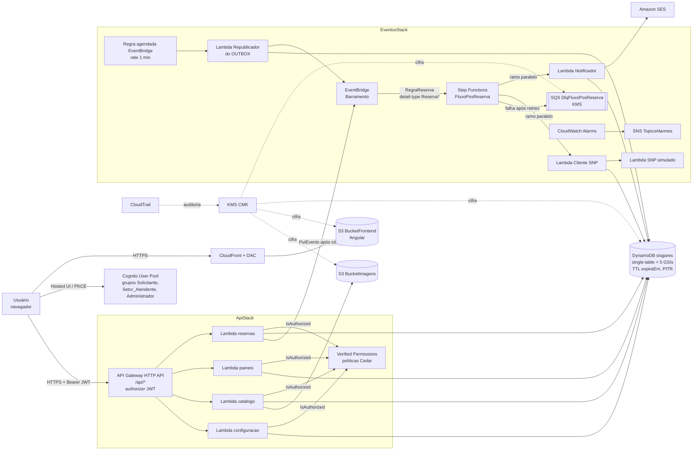
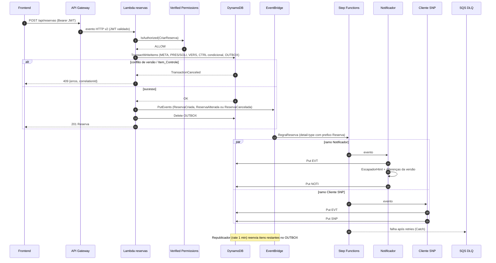

# Arquitetura do SISGARES

Solução serverless na AWS (região `us-east-1`), provisionada em CDK Java (`infra/`), com cinco stacks:
`SegurancaStack` (CMK KMS e CloudTrail), `DadosStack` (tabela DynamoDB `sisgares` e buckets S3),
`ApiStack` (HTTP API, Lambdas de API, Verified Permissions), `EventosStack` (EventBridge, Step Functions,
consumidores e DLQ) e `FrontStack` (CloudFront com Origin Access Control para o Angular).

## Diagrama AWS

Pontos principais:

- Autenticação no Cognito; autorização no backend por Amazon Verified Permissions com as políticas de
  `infra/cedar/` (`criar-reserva`, `dono-reserva`, `atendente-setor`, `admin-reservas-unidade`,
  `admin-cadastros-unidade`, `admin-configuracao`, `proibir-manutencao-nao-admin`). O frontend apenas esconde opções.
- Cada Lambda tem papel IAM próprio, restrito às ações e ARNs que usa; logs no CloudWatch com retenção de 90 dias.
- Dados em repouso cifrados pela CMK (DynamoDB, S3, SQS, CloudTrail); tráfego somente via TLS.

## Fluxo de eventos

A gravação da reserva e do evento no `OUTBOX` ocorre na mesma `TransactWriteItems`. Após o commit, a Lambda
de reservas publica o Evento_Reserva no EventBridge e remove o item do outbox; se a publicação falhar, o
Republicador (agendado a cada minuto) reenvia os pendentes. O evento contém apenas ID do evento, `RESE_ID`,
número da versão e tipo, sem dados pessoais.

Consumidores são idempotentes: o item `EVT#<eventoId>` com SK igual ao nome do consumidor é gravado com
`attribute_not_exists`; reprocessar o mesmo evento não gera e-mail nem pedido SNP duplicado.
