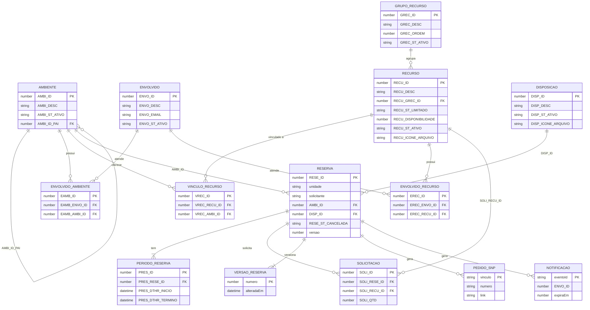

# Modelo de dados (DynamoDB single-table)

Tabela `sisgares`, chave `PK`/`SK` (String), `PAY_PER_REQUEST`, PITR, TTL no atributo `expiraEm`, cifrada com a
CMK. Chaves montadas em `backend/comum-aws/.../dynamo/Chaves.java`. Datas nas SKs usam ISO-8601 de largura fixa
(`yyyy-MM-dd'T'HH:mm:ss`) para que a ordem lexicográfica seja cronológica. Atributos `*_ST_*` valem `S` ou `N`.

## Itens

| Entidade | PK | SK | Observações |
|---|---|---|---|
| Unidade | `UNID#<unidade>` | `META` | Unidade_Macro |
| Ambiente | `AMBI#<AMBI_ID>` | `META` | `AMBI_ID_PAI`, `raizId` da árvore |
| Setor do ambiente | `AMBI#<AMBI_ID>` | `EAMB#<ENVO_ID>` | `dados-envolvido-ambiente.csv` |
| Vínculo recurso-ambiente | `AMBI#<AMBI_ID>` | `VREC#<RECU_ID>` | `dados-vinculo-recurso.csv` |
| Disposição | `DISP#<DISP_ID>` | `META` | ícone em S3 |
| Grupo de recurso | `GREC#<GREC_ID>` | `META` | ordem de exibição |
| Recurso | `RECU#<RECU_ID>` | `META` | `RECU_ST_LIMITADO`, `RECU_DISPONIBILIDADE` |
| Setor do recurso | `RECU#<RECU_ID>` | `EREC#<ENVO_ID>` | `dados-envolvido-recurso.csv` |
| Setor_Envolvido | `ENVO#<ENVO_ID>` | `META` | e-mail do setor |
| Índice do catálogo | `CATALOGO#<tipo>` | `<id>` | cópia do item principal; tipos `UNID`, `AMBI`, `DISP`, `GREC`, `RECU`, `ENVO` |
| Texto alternativo de ícone | `ICONE#<nome>` | `META` | gravado pelo seed |
| Usuário | `USER#` | `META` | perfil, unidade, Setor_Envolvido opcional |
| Reserva | `RESE#<RESE_ID>` | `META` | campos da reserva, `versao`, `criadoEm`, GSI4 |
| Período | `RESE#<id>` | `PRES#<PRES_ID>` | GSI1 (fora do Local_Proprio) e GSI3 |
| Cópia do período por setor | `RESE#<id>` | `PRES#<PRES_ID>#ENVO#<ENVO_ID>` | GSI2 |
| Solicitação de recurso | `RESE#<id>` | `SOLI#<SOLI_ID>` | sem GSI |
| Cópia da solicitação por período | `RESE#<id>` | `SOLI#<SOLI_ID>#PRES#<PRES_ID>` | GSI5 |
| Versão_Reserva | `RESE#<id>` | `VERS#0001` | instantâneo por versão (4 dígitos) |
| Pedido_SNP | `RESE#<id>` | `SNP#<vinculo>` | número e link do pedido |
| Notificação | `RESE#<id>` | `NOTI#<eventoId>#<ENVO_ID>` | caixa simulada, `expiraEm` = 90 dias |
| Item_Controle de árvore | `CTRL#AMBI#<raizId>` | `CTRL` | `versao` para escrita condicional (RN7) |
| Item_Controle de recurso | `CTRL#RECU#<RECU_ID>` | `CTRL` | recursos limitados |
| Evento processado | `EVT#<eventoId>` | `<consumidor>` | idempotência dos consumidores |
| Outbox | `OUTBOX` | `<ts ISO>#<eventoId>` | `payload`, `tentativas`; removido após publicação |
| Sequência | `SEQ#RESE` / `SEQ#PRES` | `META` | contador atômico (`ADD`) de RESE_ID e PRES_ID |
| Configuração global | `CONFIG` | `GLOBAL` | antecedência e faixa horária |
| Configuração por unidade | `CONFIG` | `UNID#<unidade>` | faixa substitui a global |

Toda cópia (PRES/SOLI) carrega `RESE_ST_CANCELADA`. Em reserva cancelada, os atributos de GSI1 e GSI5 são
removidos (deixa de ocupar ambiente e recurso); GSI2, GSI3 e GSI4 permanecem para os painéis exibirem CANCELADA.

## GSIs

Projeção `ALL` em todos.

| GSI | PK | SK | Uso |
|---|---|---|---|
| GSI1 | `RAIZ#<raizId>` | `<dataIni>#<reseId>` | conflitos na árvore de ambientes (RN5, margem) |
| GSI2 | `ENVO#<ENVO_ID>` | `<dataIni>#<reseId>` | Painel do Atendente (setor) |
| GSI3 | `UNID#<unidade>` | `<dataIni>#<reseId>` | Painel do Administrador e do Solicitante |
| GSI4 | `SOLIC#` | `<criadoEm>#<reseId>` | Minhas reservas |
| GSI5 | `RECU#<RECU_ID>` | `<dataIni>#<reseId>` | quantidade comprometida de recurso |

## Padrões de acesso

| Padrão | Operação |
|---|---|
| Obter reserva completa | Query `PK=RESE#<id>` |
| Histórico de versões | Query `PK=RESE#<id>`, `begins_with(SK, VERS#)` |
| Conflitos de ambiente no período | Query GSI1 `RAIZ#<raiz>` com `BETWEEN` (limite superior + `#\uffff`) |
| Disponibilidade de recurso | Query GSI5 `RECU#<id>` com `BETWEEN` |
| Painel por setor | Query GSI2 `ENVO#<id>` com `BETWEEN` |
| Painel por unidade | Query GSI3 `UNID#<u>` com `BETWEEN` |
| Minhas reservas | Query GSI4 `SOLIC#` |
| Listar catálogo | Query `PK=CATALOGO#<tipo>` |
| Setores / recursos do ambiente | Query `PK=AMBI#<id>`, `begins_with(SK, EAMB#)` ou `VREC#` |
| Setores do recurso | Query `PK=RECU#<id>`, `begins_with(SK, EREC#)` |
| Configuração | GetItem `CONFIG/GLOBAL` e `CONFIG/UNID#<u>` |
| Próximo ID | UpdateItem `ADD` em `SEQ#RESE` / `SEQ#PRES` |
| Eventos pendentes | Query `PK=OUTBOX` (ordem cronológica) |
| Idempotência | PutItem `EVT#<eventoId>` com `attribute_not_exists` |

Gravação atômica (`GravadorReservas`): uma `TransactWriteItems` com `Put META` (`attribute_not_exists(PK)` na
criação ou `versao = :lida` na alteração), Put/Delete dos filhos, `Put VERS#n`, `Update` condicional dos
Item_Controle envolvidos e `Put OUTBOX`. Falha de condição resulta em HTTP 409. Todas as expressões usam
`ExpressionAttributeValues`.

## Diagrama ER (CSVs de origem)

CSVs em `dados/`: `dados-ambiente`, `dados-disposicao`, `dados-envolvido`, `dados-envolvido-ambiente`,
`dados-envolvido-recurso`, `dados-grupo-recurso`, `dados-recurso`, `dados-vinculo-recurso`,
`dados-periodo-reserva` e `dados-solicitacao` (todos `.csv`, carregados pelo `HandlerSeed`).
